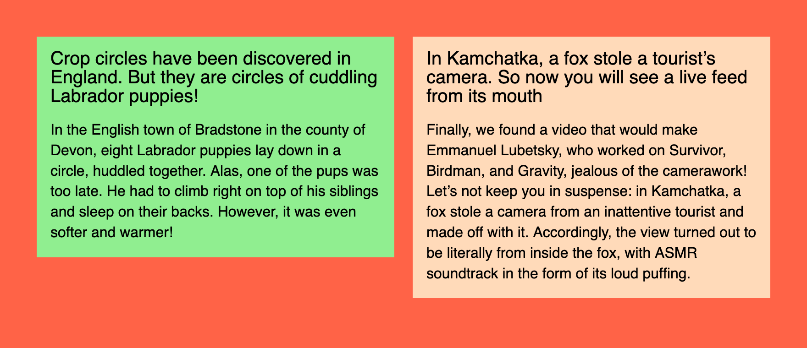
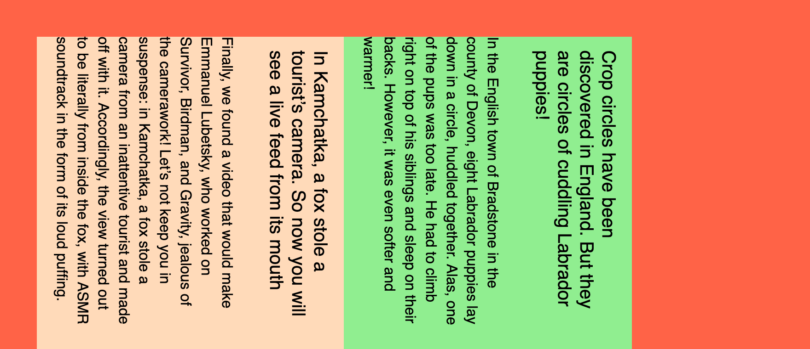
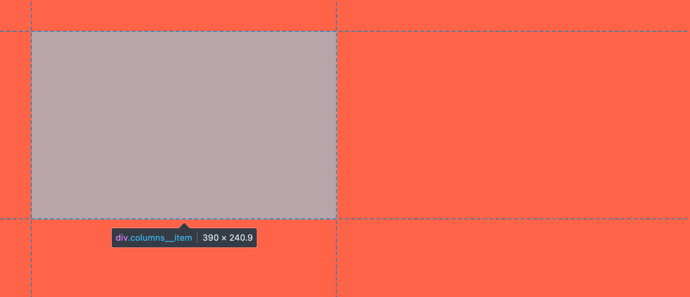
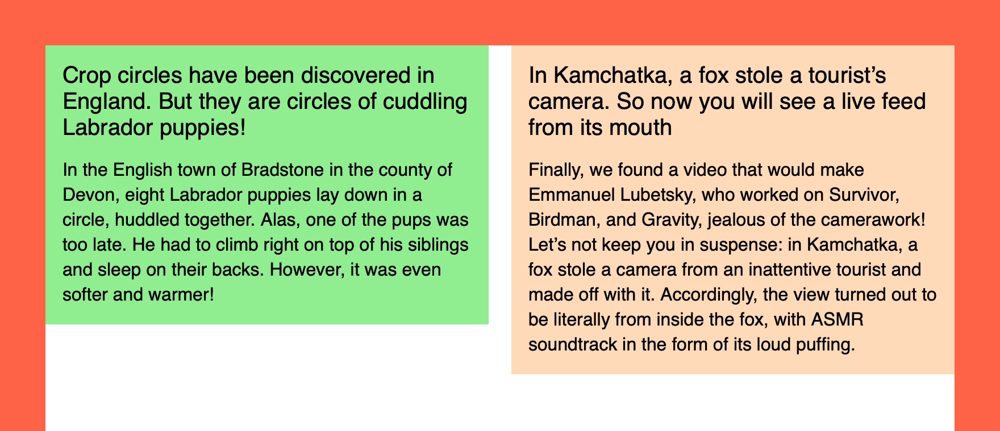

## A challenge

Imagine you need to create a two-column layout. Yes, the simplest one: a column on the left, a column on the right, and some gap in-between. There’s an obvious modern solution for that:

```css
.columns {
    display: grid;
    grid-template-columns: 1fr 1fr;
    gap: 20px;
}
```

Done! Sure, but what if we need to support some older browsers? Flexbox then. All right! And what about text flowing from one column to another? No problem, multi-columns. How about old email clients? Well, some of us still remember how to use table layouts.

You see, that’s the beauty of CSS: there are multiple solutions for almost every problem, so you can choose the one that fits your exact needs. But not just CSS, there are many HTML and SVG tricks that can help you in some cases. It’s like a natural language: the bigger your vocabulary is, the better you can express yourself.

There’s even an interview strategy based on that: you can ask talent to come up with multiple ways of solving the same simple task. And this is exactly where the idea of this article came from.

A friend of mine challenged me once with a task from the job interview: how many ways of making a two-column layout do you know? What a silly question, right? But it got me deeper than I thought. I couldn’t think of anything else for a while until I went through all the possible and _impossible_ ideas in my head. It boiled down to 11 ways of making two columns with a gap.

But I’d like to call them 6+5 to split them into two groups:

1. Six pretty reasonable ones, that make sense and could be used in a real production project (or used to).
2. Five completely wrong ones, that have some quirks, look or behave weirdly, but still accomplish the task.

By the way, the results look the same in all modern browsers, even the five weird ones.

## Setup and rules

To make it closer to reality, I decided to split the whole thing into two components:

1. Columns: fixed layout with two columns and a gap.
2. News: fluid cards that would fit the columns.

The idea is to have a columns component that could be filled with the real content, not just to draw two colored boxes next to each other.


The look that we’re aiming for

The news component will always stay the same, we’re going to play with the columns component only. The first news will have a `lightgreen` background, the second one — the famous `peachpuff`.

## Reasonable six

How would you sort the list of reasonable options? Well, probably not alphabetically. From the best to the worst? They’re all good at certain situations and have some unique advantages. So I decided to go with the historical order: I’ll start with the ones that I’ve learned first and finish with the modern ones.

### Tables

⚙️ [Demo: two columns and a gap with tables](demos/table.html)

Tables were the first layout tool available in browsers. And I used them to create my first webpage back in 2002. To make a table layout you need a parent wrapper `<table>`, some `<tr>` rows, and `<td>` cells for columns.

```html
<table class="columns">
<tr>
    <td class="columns__item columns__item--first">
        <!-- Left -->
    </td>
    <td class="columns__item columns__item--second">
        <!-- Right -->
    </td>
</tr>
</table>
```

I’m going to use BEM notation for class names, just like I’d do in a real project. And we’re going to use pretty much the same column component structure for all demos, but in some cases, we won’t need first/second modifiers.

It’s worth noting that even though tables are listed in the “reasonable” group, they’re quite outdated and should be used only for… you know, tables and tabular data. You might have a reason to use them for email layouts, but I’m not even sure if they’re needed there anymore. And it’s a nightmare from the accessibility point of view, so let’s consider it a history lesson.

To make tables disappear and behave like a neutral column component we need to fix some things: `border-collapse` and `padding` properties to remove extra padding and `vertical-align: top` to align content to the top. Yes, tables used to be the easiest way to align things vertically.

```css
.columns {
    border-collapse: collapse;
}

.columns__item {
    padding: 0;
    width: 50%;
    vertical-align: top;
}
```

To make a gap in 2002 I’d use another empty cell in the middle with some extra element to fix the width. Wild times! But today I’d prefer some padding instead: 10px from the left and 10px from the right, nothing too fancy.

```css
.columns__item--first {
    padding-right: 10px;
}

.columns__item--second {
    padding-left: 10px;
}
```

You might think that using `display: table` on a `<div>` could be considered another way of making a two-column layout. But I think that tables are tables, doesn’t matter if this behavior comes from browser or author styles.

And here comes the news:

```html
<article class="news">
    <h2 class="news__title">Title</h2>
    <p class="news__lead">Content</p>
</article>
```

Once we have both news in each table cell, the first “reasonable” layout is ready. Ten more to go!

### Floats

⚙️ [Demo: two columns and a gap with floats](demos/float.html)

The next layout technique I learned were floats. They were invented for a newspaper or magazine-like content layouts where text would “float” around pictures, quotes, or similar elements. I tried this first in Adobe PageMaker when laying out an actual newspaper and it was very nice to have floats available on the Web too.

Some clever people realized that if you’d get rid of text and float one box to the left and another to the right, that would make a layout! Though it’s important to make sure that floated elements won’t compete for space, otherwise they’d just start dropping down from the row.

In this case, we won’t need any special HTML elements to make it work, so let’s stick with abstract divs. It’s just a layout, after all.

```html
<div class="columns">
    <div class="columns__item columns__item--first">
        <!-- Left -->
    </div>
    <div class="columns__item columns__item--second">
        <!-- Right -->
    </div>
</div>
```

Here comes the main catch with floats: they need to be “cleared”. If you have floating elements in your container, they will fall out of it and the container would collapse to zero height.

There are two main ways of clearing floats:

1. Change some properties of the container.
2. Put some fake content at the end of the container.

Let’s go with the first option. Back in float layouts days, we’d use `overflow: hidden`, which comes with the obvious drawback: content gets clipped. But today we can use a special `display` value:

```css
.columns {
    display: flow-root;
}
```

I’d call it `display: clear-floats` instead, but that’s why I don’t have a chance to get into [CSSWG](https://wiki.csswg.org).

Now we need to set up columns’ width and since they’re not glued together like table cells, it’s possible to set them apart with half of the width minus half of the gap. The magic of `calc` wasn’t available back then, just like `border-radius`, but it’s 2022, so:

```css
.columns__item {
    width: calc(50% - 10px);
}
```

Let’s finally float them to different sides of the parent:

```css
.columns__item--first {
    float: left;
}

.columns__item--second {
    float: right;
}
```

And there you have it! The second slightly more “reasonable” two-column option. Let’s try the next one!

### Inline blocks

⚙️ [Demo: two columns and a gap with inline blocks](demos/inline-block.html)

Layouts based on inline blocks were popular around the same time as floats. But they were a little bit more finicky to deal with. We’ll use the same markup as with floats, but we won’t need any first/second modifiers.

First of all, we need to make inline blocks out of our columns to make the whole thing work. Since they are inline they’re happy to stay “in line”, but they’re also blocks and you can still set their width (unlike just inline elements). Let’s also align them to the top, not the default baseline.

```css
.columns__item {
    display: inline-block;
    width: calc(50% - 10px);
    vertical-align: top;
}
```


A gap that doesn’t look right

Now our news blocks are in “columns”, but the gap between them doesn’t look right. It looks like a typical white space. Well, because it is! All the nesting in our HTML is routinely squashed by the browser into a single white space since it’s an inline context.

There are two popular ways to get rid of it:

1. Set the parent’s font size to zero.
2. Remove all the spaces between the tags in markup.

The second way is rather fragile, so let’s go with the first one. And since `font-size` is an inherited property, let’s not forget to revert it for the content.

```css
.columns {
    font-size: 0;
}

.columns__item {
    font-size: 16px;
}
```

Once we have both our columns sitting right next to each other, we can make the exact 20px gap between them. Since it’s the inline context, we can treat our parent element as a sentence, which makes nested columns words… do you see where it’s going? That’s right! The `word-spacing` property will do the trick.

```css
.columns {
    word-spacing: 20px;
    font-size: 0;
}

.columns__item {
    word-spacing: normal;
    font-size: 16px;
}
```

Let’s not forget to reset it to `normal` for the nested elements, just like we did for the `font-size`.

That was the third way, the next three will finally start making sense, I promise.

### Multi-columns

⚙️ [Demo: two columns and a gap with multi-columns](demos/multi-column.html)

It’s time for the first layout technique that was designed for layouts. Well, almost. Multi-columns can take any content and make it flow through the columns with some native gaps in-between. As seen in newspapers!

```css
.columns {
    columns: 2 20px;
}
```

That’s it! I’m not a big fan of magic shorthand properties like `flex`, but I just couldn’t resist. Two columns and a 20px gap set in a single property! Isn’t it elegant? But there’s something wrong:


Broken TV effect

Since content is flowing from one column to another, some block parts are flowing too. It looks like a broken portal or an old TV, but there’s an easy fix: a polite `avoid` value for the brutal `break-inside` property.

```css
.columns__item {
    break-inside: avoid;
}
```

That was quick! The fourth two-column layout. Let’s see if there’s anything even better than that.

### Flexbox

⚙️ [Demo: two columns and a gap with Flexbox](demos/flexbox.html)

Here comes the most popular layout technique these days. It’s been around for a while, but back in the old days there used to be differences in browser implementations and just [obvious bugs](https://github.com/philipwalton/flexbugs) that made Flexbox tricky to use. But not anymore!

Now it’s as easy as:

```css
.columns {
    display: flex;
    gap: 20px;
}

.columns__item {
    width: 50%;
}
```

But if you don’t have the luxury of supporting only recent browser versions, you’ll have to say goodbye to the `gap` property and use some extra code to make some space between columns. Push the columns to the sides and make sure their width is set with `calc` just like we did before.

```css
.columns {
    display: flex;
    justify-content: space-between;
}

.columns__item {
    width: calc(50% - 10px);
}
```

Finally, something modern and usable, the fifth already! Flexbox is relevant today, unlike many techniques we’ve discussed. But these days I often reach for the next option.

### Grid Layout

⚙️ [Demo: two columns and a gap with Grid Layout](demos/table.html)

Seriously, Grid Layout makes so much sense in almost every layout situation, even for micro-layouts like putting an icon next to a word. Remember? This is what we’ve started from:

```css
.columns {
    display: grid;
    grid-template-columns: 1fr 1fr;
    gap: 20px;
}
```

The beauty of it is that the whole layout is defined by the container. Sure, in some cases you’ll need to apply some properties to the nested elements, but it’s possible to achieve basic layouts using just the container’s properties. It’s especially useful for making your layouts responsive with Media Queries.

Also, because `grid-gap` and later just `gap` properties were part of the initial Grid Layout implementations, you don’t have to worry about browser compatibility so much, compared to `gap` in Flexbox.

That was _way too simple_ the sixth way of making a two-column layout. Don’t worry, we have some pretty weird things coming up.

## Weird five

There’s no historical order here. I just tried to list the options from the least weird to completely wrong. And what were the problems that made me split these methods into a special group?

First of all, they’re not always playing nice with the content flow. On the Web, we used a principle that the next content block would go right after the previous one, not on top of it. And once the previous block gets smaller or bigger, all the following blocks move up or down with it.

If you ever hand-coded an SVG file, you probably know what I’m talking about. Imagine if every block would be absolutely positioned at the top left corner of the document. That would make our job much more difficult. It’s totally fine for the SVG as an image format, but not acceptable for a content layout.

Other methods are making things too complicated with extra markup, misusing some CSS properties, making it work only in a single browser, or compromising the content accessibility. Still, let’s explore them one by one to learn something new, or at least have some fun.

### Positioning

⚙️ [Demo: two columns and a gap with positioning](demos/position.html)

Positioning is not the best layout technique because it breaks the content flow, one of the main principles of the Web. But it’s still a useful tool in some cases. Unlike shapes in SVG, we don’t have to position elements from the top left corner of the document every time: fortunately, there’s a way to nest positioning.

Let’s keep the parent component in the flow with `position: relative`. In this case, nested column positioning will start from the parent component, even though it will collapse to zero height just like with floats. Unfortunately, there’s no way to “clear” positioned elements.

```css
.columns {
    position: relative;
}

.columns__item {
    position: absolute;
    top: 0;
    width: calc(50% - 10px);
}
```

Since absolutely positioned elements are in their _parallel world,_ they tend to contain things in a funny way, so let’s limit their width with `calc`. And just like with floats, let’s push our columns to the sides so they won’t overlap.

```css
.columns__item--first {
    left: 0;
}

.columns__item--second {
    right: 0;
}
```


The first dangerously red option

Hmm, there’s something different with this demo! Unlike previous purple demos, this one has a page background filled with tomato color. That’s because it looks slightly more dangerous to highlight the nature of this group.

So there you have it: the first weird way. Nothing too scary, right? Of course, we’re just warming up.

### Writing mode

⚙️ [Demo: two columns and a gap with writing mode](demos/writing-mode.html)

To understand how the next method works, let’s think about this very text: not the meaning of it, but the shape. I’m writing it in horizontal lines that go one after another from top to bottom. This behavior is common for many languages and controlled with the `writing-mode` property. In this case, its value is `horizontal-tb`, meaning “horizontal, top to bottom”.

But in some languages text could go in vertical columns, not horizontal rows. This gives us two other `writing-mode` values: `vertical-rl` and `vertical-lr`. The first part of the value is fairly simple, the second depends on the direction of the text: LTR or RTL. Anyway, new lines in this vertical mode go either to the left or to the right from the previous one.

Knowing that let’s try a silly thing: change the parent’s block writing mode to vertical, so the lines would become columns and start from the right.

```css
.columns {
    writing-mode: vertical-rl;
}
```


You might have to tilt your head a bit

See, this already looks like a layout! But some things need to be fixed to make it usable. Just like in `font-size: 0` case we need to restore the `writing-mode` for the columns to the previous state. And while we’re at it, let’s add width to our columns.

```css
.columns__item {
    width: 390px;
    writing-mode: horizontal-tb;
}
```

Unfortunately, there’s no way for us to use the `gap` property outside of Flexbox or Grid Layout. So let’s use the good old trick: a column followed by another column will get the right margin.

```css
.columns__item + .columns__item {
    margin-right: 20px;
}
```

I probably should’ve used `.columns__item—first` selector instead, but that would be way too easy. I’m trying to use as many tricks as possible here!

Hopefully, you can smell the same weird thing in both `font-size: 0` and `writing-mode: vertical-rl` cases: they both fragile and misuse properties that weren’t meant for layout.

Still, the second weird two-column layout. Ready for another one? Let’s go!

### SVG

⚙️ [Demo: two columns and a gap with SVG](demos/svg.html)

I already mentioned SVG as merely a graphics format that could be hand-coded, but doesn’t fit our layout needs. Sorry, but I lied to you. You weren’t ready for the truth at the beginning. But now you’ve been through a lot of weird stuff and are ready for anything.

Let’s start from CSS… and finish right away. This is the only styling we’re going to need.

```css
.columns {
    display: block;
    width: 100%;
    height: 100%;
}
```

You can already see that this method is as friendly to content flow as absolute positioning (not at all). As for HTML, it’s not going to look pretty:

```html
<svg class="columns">
    <foreignObject>
        <article class="news news--first">
            <h2 class="news__title">Title</h2>
            <p class="news__lead">Content</p>
        </article>
    </foreignObject>
    <foreignObject>
        <article class="news news--second">
            <h2 class="news__title">Title</h2>
            <p class="news__lead">Content</p>
        </article>
    </foreignObject>
</svg>
```

Well, it’s not exactly HTML, but rather SVG with some HTML inside. Still, inside of the HTML document. I don’t know if it’s legal, but it’s [fully valid](https://validator.w3.org/nu/#textarea):

> Document checking completed. No errors or warnings to show.

Usually, SVG won’t allow you to have some arbitrary HTML inside, apart from similarly named [`<a>`](https://www.w3.org/TR/SVG2/linking.html#AElement) and [`<script>`](https://www.w3.org/TR/SVG2/interact.html#ScriptElement) SVG elements. But if you ask nicely using `<foreignObject>` it’ll be fine.

To make it work, we need to position these foreign agents… sorry, I mean foreign objects using presentational attributes. This is pretty common and quite handy in SVG since it’s merely a graphics format, remember? Instead of `left/top` we have `x/y`, the rest is pretty similar. But there’s no easy way to make `right: 0` alternative, so we’ll have to position the right column from the left as well.

```html
<foreignObject x="0" y="0" width="390" height="100%">
    <!-- Left -->
</foreignObject>
<foreignObject x="410" y="0" width="390" height="100%">
    <!-- Right -->
</foreignObject>
```

Unfortunately, there’s no way for SVG-wrapped content to influence the parent’s dimensions as HTML elements do. So we’ll have to set it ourselves: in our case, it takes the whole page’s height.

That’s the third weird two-column layout. Let’s explore a slightly more reasonable fourth one to prepare for the worst.

### Element

⚙️ [Demo: two columns and a gap with element](demos/element.html)

When setting up the rules, I mentioned that we’re trying to make something practical here, not just draw two boxes next to each other. But there is a way to take some real content and draw it as a background image. It’s not Canvas, it only works in Firefox, and you should never use it. Sounds exciting!

To make it work, let’s resize our columns to half of the parent width minus half of the gap, the usual thing. Then we clip them so they would become invisible and take them out of the flow with positioning. Sure, why not.

```css
.columns__item {
    position: absolute;
    clip-path: inset(50%);
    width: calc(50% - 10px);
}
```


Not `display: none`, but visually hidden

See, the columns are still there, but they’re invisible. Let’s put them back the way we need them! But the parent’s height is collapsed now without any content, let’s fix it with `height: 100%`. Relative positioning would keep those columns sizing and position relative to the parent block.

```css
.columns {
    position: relative;
    height: 100%;
}
```

Now it’s time for some magic. Only for this demo we have IDs for each news in our markup: `news-first` and `news-second`. We can use those IDs to make these elements sources for `background-image` property with [`-moz-element`](https://developer.mozilla.org/en-US/docs/Web/CSS/element) function. Thanks to multiple background images, we can use just a single element for that. Positioning our elements: the first goes to `left top`, the second goes to `right top`. And we don’t need the repeating.

```css
.columns {
    background-image:
        -moz-element(#news-first),
        -moz-element(#news-second);
    background-position:
        left top,
        right top;
    background-repeat: no-repeat;
}
```

The CSS syntax of VS Code thinks that something is wrong with IDs in the functions, but it works! Well, only in Firefox at the moment. And as I mentioned before, it’s not ready to be used in any production code. Though it’s not just made up, since it’s a part of [CSS Images Module Level 4 draft](https://drafts.csswg.org/css-images-4/#element-notation).

Let’s hope this feature will be supported in all browsers at some point. It’s been around for a while only in Firefox. But once again, using it for laying out content is not a good idea in any case.

The fourth weird layout method wasn’t that bad compared to what’s coming next. I sincerely apologize in advance.

### Frames

⚙️ [Demo: two columns and a gap with frames](demos/frame.html)

You might know what `<iframe>` is, but you probably haven’t used the `<frame>` element much. It serves a similar purpose by giving you a “window” to another document. The main difference between them is that `<iframe>` is a standalone element, but `<frame>` elements come in sets called `<frameset>`. And those framesets have some layout capabilities!

To make the layout that we’re aiming for, we’ll need three frames in a set: two for columns and one in the middle for the gap. The exact widths for our frames could be specified in the `cols` attribute. It doesn’t matter that the total width exceeds 100%, browsers won’t overflow the set, just like they do with tables.

```html
<frameset cols="50%, 20, 50%" border="0">
    <frame frameborder="0" src="">
    <frame frameborder="0" src="">
    <frame frameborder="0" src="">
<frameset>
```

Unlike the `<iframe>` elements where “i” stands for “inline”, `<frameset>` is supposed to take the whole window. Not only that, it is supposed to replace the `<body>` element. It would be impossible to use such a layout technique on a page with other elements. No problem! We can wrap it in another inline frame.

Frames also require external documents to work, so you’d have to separate your `<frameset>` into _columns.html_ and link it in `<iframe>` via `src` attribute. You’d also need to separate news into _news-one.html_ and _news-two.html_ files and link them via `src` attributes as well. Remember, I apologized for the method in advance!

But there’s another way we can make it work without external files and nested documents. Well, sort of. We can use `data:uri` and nest everything in a single document. But we should be careful with quotes, you’ll see why.

Let’s start with CSS for the `<iframe>`, nothing too fancy:

```css
.columns {
    display: block;
    width: 100%;
    height: 100%;
    border: none;
}
```

And here comes the markup, the most exciting part. Instead of the URL of the file in `src` attribute, we have its content with the special `data:text/html,` prefix to let the browser know that it’s not a URL, but the “file” itself. The content starts with `<!DOCTYPE html>` to stay in [standards mode](https://developer.mozilla.org/en-US/docs/Web/HTML/Quirks_Mode_and_Standards_Mode), then follows the charset (just in case). I skipped the `<title>` element because I’m a bad person. Please don’t ever do it.

```html
<iframe class="columns" src="data:text/html,
    <!DOCTYPE html>
    <meta charset='utf-8'>
    <frameset cols='50%,20,50%' border='0'>
        <frame frameborder='0' src='data:text/html,'>
        <frame frameborder='0' src='data:text/html,'>
        <frame frameborder='0' src='data:text/html,'>
    </frameset>
"></iframe>
```

Now we have three nested frames with empty files in `src` attributes. We’re going to keep the middle one empty because it’s just a gap. As for the other two, there will be our news documents. I usually have double quotes in my markup, but I had to switch to single ones in the nested document to make it work. On the next nesting level, I’ll just stop using them altogether.

So let’s get the actual content the same way we did with the `<frameset>`: barebones HTML document, some styles, and the news. Unfortunately, I couldn’t make the `<link rel="stylesheet" href="news.css">` work, so I had to use inline styles. But I wouldn’t blame it for giving up in such a mess of a markup.

```html
<iframe class="columns" src="data:text/html,
    <!DOCTYPE html>
    <meta charset='utf-8'>
    <frameset cols='50%, 20, 50%' border='0'>
        <frame frameborder='0' src='data:text/html,
            <!DOCTYPE html>
            <meta charset=utf-8>
            <style>
                /* News styles */
            </style>
            <article class=news>
                <h2 class=news__title>Title</h2>
                <p class=news__lead>Content</p>
            </article>
        '>
    </frameset>
"></iframe>
```

The same goes for the second news, the only difference is background color and content. And the thing that surprises me the most is that it works in Firefox, Chrome, and Safari, even though `<frameset>` and `<frame>` elements are deprecated for a long time.

The only problem I couldn’t solve is the `<frameset>` background color in Safari: for some reason, it’s white, though it’s transparent in other browsers. This behavior is not mentioned anywhere, [even in HTML spec](https://html.spec.whatwg.org/multipage/rendering.html#frames-and-framesets) that describes `<frame>` and `<frameset>` behavior in detail for compatibility reasons.


Safari ruined an otherwise _perfectly viable_ layout option

That was the last weird two-column technique I came up with. Was it practical? Hell no! Did I have a lot of fun building it? Definitely.

* * *

I hope you’ve learned something new along the way. That’s the beauty of the Web platform: there are multiple ways of doing the same thing. And if you know all of them you’re practically unstoppable and ready to implement anything that life might challenge you with.

And if you liked this kind of thinking, you might enjoy the “[How do I draw a line?](https://youtu.be/TUeb4MBbhTE)” video, by Heydon Pickering.
